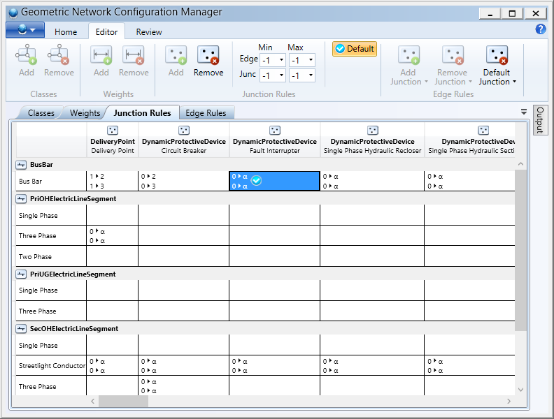
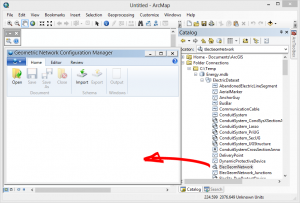
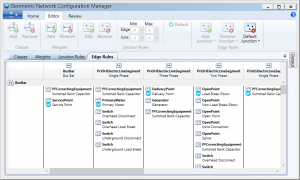
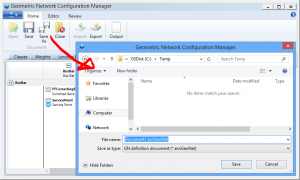

# Geometric Nework Configuration Manager

This project is for an [ArcGIS Desktop](http://www.esri.com/software/arcgis/arcgis-for-desktop) add-in designed to backup or modify the definition of [geometric network](http://help.arcgis.com/en/arcgisdesktop/10.0/help/index.html#//002r00000001000000).  In [some instances](http://resources.arcgis.com/en/help/main/10.2/index.html#/Managing_a_geometric_network/002r0000000v000000/) it may be necessary to temporarily remove a geometric network, this tool can be used to recreate the geometric network from a backed-up definition file.

Configuration Manager has a very long lineage.  More than a decade ago the Prototype Lab published [Geodatabase Designer](http://arcscripts.esri.com/details.asp?dbid=13484) for documenting geodatabases and exchanging schema.  Designer is now obsolete but fortunately much of its capabilities are now incorporated into ArcMap or other tools such as [ArcGIS Diagrammer](http://www.arcgis.com/home/item.html?id=51b6066bfd024962999f6903682d8978) and [XRay for ArcMap](http://www.arcgis.com/home/item.html?id=f0ae73e90c1a4992a1059e7d370966d4).

However the one feature from Designer that has yet to be replicated is the ability to save and restore geometric networks.  This useful if loading large amounts data or performing a schema change like switching a feature class from a simple edge to a complex edge.

#### Prerequisites

- [Esri](http://www.esri.com/) [ArcGIS Desktop](http://www.esri.com/software/arcgis/arcgis-for-desktop) 10.2
- Microsoft [.NET Framework 4.5](https://www.microsoft.com/en-us/download/details.aspx?id=30653)

#### Libraries Used

- [AvalonDock](http://avalondock.codeplex.com/)
- Microsoft [Ribbon for WPF October 2010](https://www.microsoft.com/en-us/download/details.aspx?id=11877)

The following section will walkthrough the steps required to backup geometric network, remove it and then restore it.  The use case for this workflow could be for bulk data loading or transferring a geometric network from a test server to a production server.

#### Walkthrough

Following the successful installation of the add-in.  Display the Geometric Network Tools toolbar and click the first button to launch the main dialog.  Drag and drop a geometric network into the configuration manager window.

The complete definition of the geometric network will be loaded into the dialog.  The four tabs below the ribbon make it is possible to review and, in some cases, modify classes, weights and connectivity rules.

The geometric network definition is current stored in memory and should really be saved to a file so that it can backed-up or restored at a later time.  Click the save or Save As button to export the definition to a file with a esriGeoNet extension.

Recreating a geometric network is just a matter of loading an esriGeoNet file and clicking Export.  The application will prompt the user for the name and location of the exported geometric network.  If the geometric network already exists, it will be overwritten.

#### Known Issues:

- The dialog that appears when the Export button is click may be hidden by the Configuration Manager window.  Either minimize or move the window to the side to continue with the export operation.
- Add and removing of network classes and weights is currently not supported.
